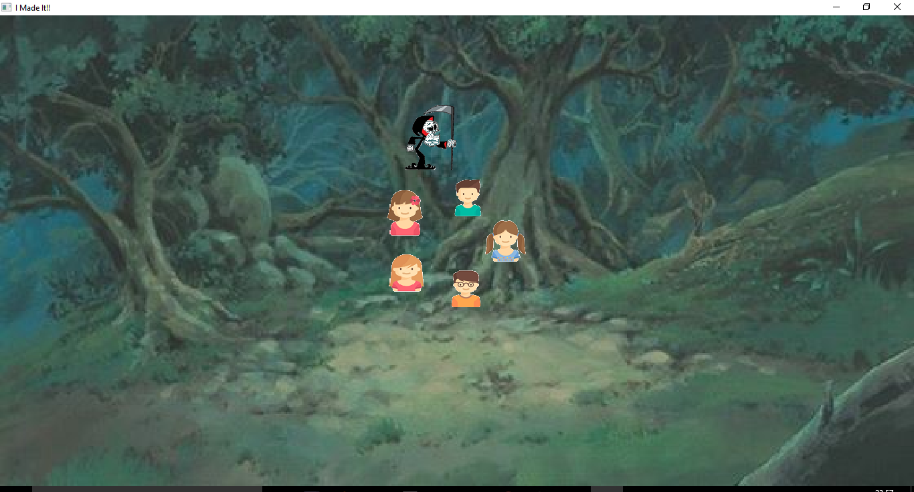

# Circle-Game

# Hello;  
I made this mini fun game ***Circle Game*** .
I used SFML library and linked list.  
First the programe will ask you about the number of kids you wants to play with;  
then it shows  window: with the kids u entred and a grim reper xD who turns around them ;  
once he stops a kid gonna be out.

// i used sound effect ;) have fun 
it's gonna apear like this : //i entred 

 
 you re going to find the code in the **scs** folder , and the pictures with music in **dist** folder 
